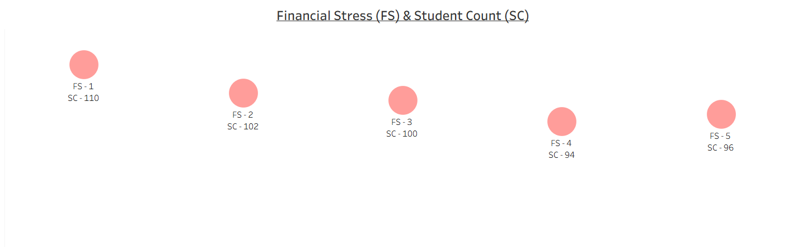

# Student Depression Analysis

### Dashboard Link: https://prod-in-a.online.tableau.com/#/site/07rajatt-4b716f42e1/workbooks/72498?:origin=card_share_link


## Problem Statement
The education sector collects significant data on student well-being, but without analysis, patterns related to mental health issues like depression remain undetected. This dashboard analyzes a student depression dataset to provide insights into factors such as sleep duration, study hours, study satisfaction, academic pressure, and financial stress. 
It helps stakeholders:

- Understand distributions of key lifestyle and stress factors among students.

- Identify potential correlations with depression indicators.

- Highlight areas for intervention, such as improving sleep habits or reducing academic pressure, through interactive visualizations and filters.

By creating interactive dashboards in Tableau, educators, counselors, and researchers can make data-driven decisions to support student mental health and academic success.

## Steps Followed
Step 1: Imported the dataset into MS SQL Server and performed initial data modeling using SQL queries.

- Added an index column for row identification:
  ```sql
  ALTER TABLE [Depression+Student+Dataset]
  ADD Index_Column INT IDENTITY(1,1)
  ```

- Updated the Depression column from binary (0/1) to readable values ('No'/'Yes'):
  ```sql
  UPDATE [Depression+Student+Dataset]
  SET Depression = 'No' WHERE Depression = '0'

  UPDATE [Depression+Student+Dataset]
  SET Depression = 'Yes' WHERE Depression = '1'
  ```

- Altered the Depression column type for flexibility:
  ```sql
  ALTER TABLE [Depression+Student+Dataset]
  ALTER COLUMN Depression VARCHAR(MAX)
  ```

- Added an Age_Group column for segmentation:
  ```sql
  ALTER TABLE dbo.[Depression+Student+Dataset]
  ADD Age_Group VARCHAR(MAX)

  UPDATE dbo.[Depression+Student+Dataset]
  SET Age_Group =
  CASE WHEN Age BETWEEN 18 AND 24 THEN 'A1'
  ELSE CASE WHEN Age BETWEEN 25 AND 30 THEN 'A2'
  ELSE 'A3' END END
  ```

Step 2: Connected the MS SQL Server database to Tableau Desktop and imported the modeled dataset.

Step 3: Performed data exploration in Tableau by checking for nulls, duplicates, and data types. Minor inconsistencies were addressed, ensuring the dataset was clean for analysis.

Step 4: Created calculated fields in Tableau where necessary, such as grouping factors like sleep duration and study hours for better visualization.

Step 5: Added filters and parameters for interactive slicing by:
  - Age Group (A1, A2, A3)
  - Depression Status (Yes/No)
  - Other factors like Study Satisfaction levels

Step 6: Designed bubble charts for categorical distributions, such as Sleep Duration and Financial Stress, to show Student Counts (SC) per category.

Step 7: Created line charts for trends in Study Hours and Academic Pressure, plotting student counts against varying levels.

Step 8: Built bar charts for Study Satisfaction, displaying satisfaction scores (SS) and corresponding student counts.

Step 9: Developed 5 separate Tableau workbooks (or sheets within a dashboard) focusing on individual factors:
  - Workbook 1: Sleep Duration Analysis
  - Workbook 2: Study Hours Trends
  - Workbook 3: Study Satisfaction Levels
  - Workbook 4: Academic Pressure Distribution
  - Workbook 5: Financial Stress Indicators

Step 10: Enabled tooltips and actions for drill-down into details, such as viewing depression correlations within each factor.

Step 11: Applied a consistent theme, colors, and layouts for a professional look, using greens and blues for positive factors and reds/purples for stress-related ones.

Step 12: Published the dashboards to Tableau Cloud for sharing and collaboration.


# Snapshot of Dashboard
## Tableau Desktop View

### Dashboard:


### Workbook 1 - Sleep Duration:


### Workbook 2 - Study Hours:


### Workbook 3 - Study Satisfaction:


### Workbook 4 - Academic Pressure:


### Workbook 5 - Financial Stress:



## Tableau Cloud View


---


---


# Insights
Following inferences can be drawn from the dashboard:

[1] Sleep Duration Distribution
- 5-6 hours: 123 students
- 7-8 hours: 128 students
- Less than 5 hours: 123 students
- More than 8 hours: 128 students
Balanced distribution, but a notable portion (246 students) get insufficient sleep (<7 hours), which may correlate with higher depression rates.

[2] Study Hours Trends
- Student counts peak around 4-6 hours (SC 42-45), then decline after 8 hours (SC 41 at 12 hours).
Suggests most students study moderately, but excessive hours (>8) affect fewer, potentially indicating burnout risks.

[3] Study Satisfaction Levels
- SS 4: 116 students (highest)
- SS 3: 103 students
- SS 5: 97 students
- SS 2: 100 students
- SS 1: 86 students
Peak satisfaction at moderate levels, implying that balanced study routines lead to higher contentment.

[4] Academic Pressure Distribution
- AP 3: 125 students (highest)
- AP 1: 99 students
- AP 5: 98 students
- AP 4: 92 students
- AP 2: 88 students
Declining trend shows more students experience mid-level pressure, but high pressure (AP 4-5) still affects ~190, warranting interventions.

[5] Financial Stress Levels
- FS 1: 110 students (highest)
- FS 2: 102 students
- FS 3: 100 students
- FS 4: 94 students
- FS 5: 96 students
Lower stress is more common, but ~190 students at FS 4-5 may face financial barriers impacting mental health.

[6] Overall Mental Health Insights
Factors like insufficient sleep and high academic pressure show higher student counts, potentially linking to 'Yes' depression cases. Age groups (A1: 18-24) dominate, suggesting young adults are most vulnerable.

# Conclusion
The Student Depression Analysis Dashboard offers a comprehensive view of key factors influencing student mental health. It empowers stakeholders to:

- Identify at-risk groups based on sleep, study, and stress patterns.

- Develop targeted support programs, such as counseling for high-pressure students.

- Monitor trends over time with updated data.

- Optimize educational policies for better well-being.

This project serves as a tool for promoting data-driven mental health initiatives in academic settings.

---

Author - Rajat Singh B.Tech Computer Science And Engineering | Data Analysis Enthusiast Email: rajattsingh10@gmail.com | LinkedIn: https://www.linkedin.com/in/rajat-singh-bb941924a/
